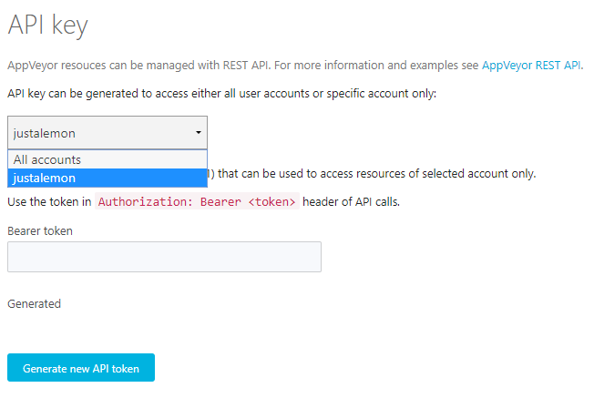

# Add Personal Token

```
c!appveyor addtoken <token>
```

Adds the specified token to our database for later use. We check that the token is valid to make sure that is useable.


To get your AppVeyor token, go to [https://ci.appveyor.com/api-keys](https://ci.appveyor.com/api-keys) and pick your current account to get the appropiate token (please note that we do not support `All accounts`/v2 tokens).


