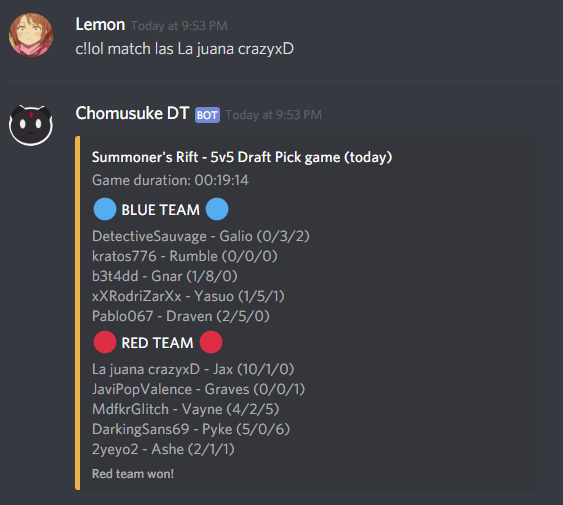

# Get Match Information

```
c!lol match <region> [index] <summoner>
```

Shows the match information from the latest or specified game for the summoner.

Example: An index of 0 means the latest match, a value of 3 means 3 matches ago.


